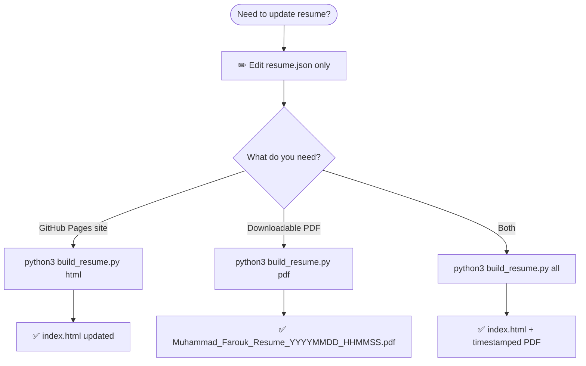

# Muhammad Farouk — Profile & Resume

**Live site:** [mofasuhu.github.io](https://mofasuhu.github.io/)

All content lives in **[`resume.json`](resume.json)**. The website and PDF are generated from it — do not edit [`index.html`](index.html) by hand.

---

### Typical session

```bash
# 1. Edit content
#    open resume.json

python3 -B build_resume.py all

git add .
git commit -m "Update resume"
git push
```


## Workflow — what to run each time




---


## One-time setup (macOS)

### 1. Homebrew system libraries (for WeasyPrint)

```bash
brew install pango gdk-pixbuf cairo libffi
```

### 2. Python packages

```bash
cd /path/to/mofasuhu.github.io
pip3 install -r requirements.txt
python3 -m playwright install chromium
```

| Tool | Purpose |
|------|---------|
| **Jinja2** | Builds HTML from templates |
| **WeasyPrint** | PDF engine (used if Playwright fails) |
| **Playwright** | PDF engine (primary on your Mac) |

> **Optional:** [wkhtmltopdf](https://wkhtmltopdf.org/downloads.html) — only if you install it separately; the script tries it first when present. Not available via Homebrew on recent macOS.

---

### Quick reference

| Goal | Command | Output |
|------|---------|--------|
| Update website only | `python3 build_resume.py html` | `index.html` |
| New PDF only | `python3 build_resume.py pdf` | `Muhammad_Farouk_Resume_YYYYMMDD_HHMMSS.pdf` |
| Website + PDF | `python3 build_resume.py all` | Both of the above |


## Files

| File | You edit? | Notes |
|------|-----------|--------|
| `resume.json` | **Yes** | Single source of truth |
| `templates/*.j2` | Rarely | Layout only |
| `main.css` / `resume_pdf.css` | Rarely | Web / PDF styling |
| `index.html` | **No** | Generated |
| `Muhammad_Farouk.pdf` | **No** | Legacy reference; script never overwrites it |
| `Muhammad_Farouk_Resume_*.pdf` | **No** | Generated; gitignored by default |

**PDF-only settings** (e.g. Google Drive certificates link): `resume.json` → `pdf` section.

---

## Troubleshooting

| Problem | Fix |
|---------|-----|
| `ModuleNotFoundError: jinja2` | `pip3 install -r requirements.txt` |
| WeasyPrint / cairo errors | `brew install pango gdk-pixbuf cairo libffi` |
| Playwright browser missing | `python3 -m playwright install chromium` |
| Site looks old after build | Hard-refresh browser; `main.css?v=2.0` should load |
